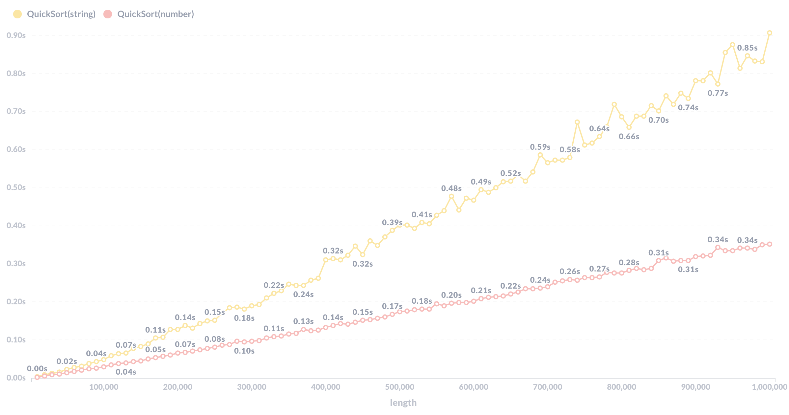
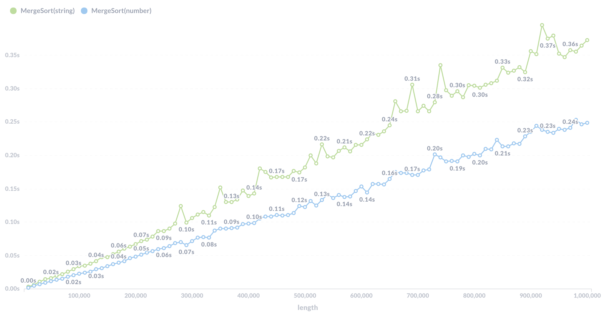
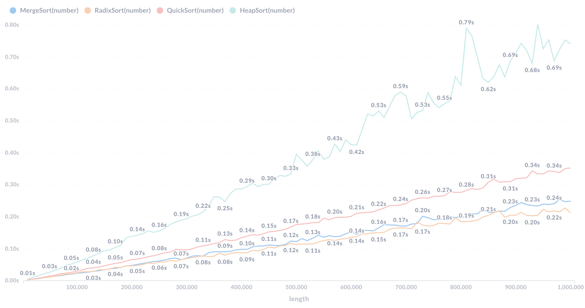
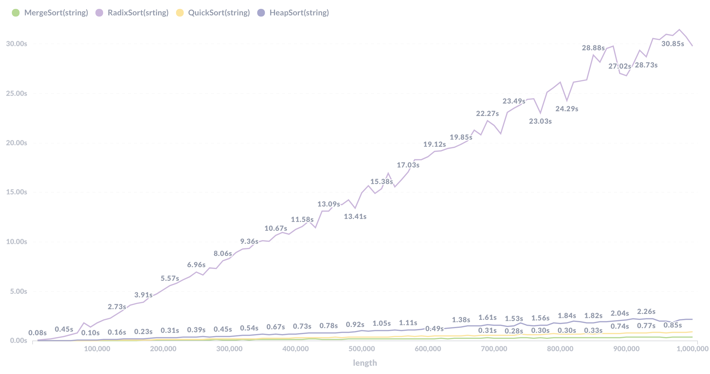

## Sorting-Comparison

#### 測試環境：

* 電腦：Macbook pro 15-inch, 2017
* 作業系統：macOS Big Sur 11.3
* CPU: i7-7700HQ(L2 Cache:1MB, L3 Cache:6MB)
* RAM: 16GB

#### 資料集生成方法

* interger

   1. 使用time.h裡的rand()函式產生隨機整數

   * pseudo code

     ```pseudocode
     function GenRandINT(length){
     	for (i=0;i<length;i++){
     		interger = rand();
     		write(interger); //寫入至檔案中
     	}
     }
     ```

* string

   1. 使用一個陣列儲存英文字母小寫"a" 到大寫"Z"

   2. 生成一個從0到51隨機數字，每次生成一個數字都代表一個英文字母

   3. 根據指定數字，生成一個陣列再將英文字母分別放到陣列中

   * pseudo code

     ```pseudocode
     function GenRandStr(length){
     	charset="abcde....";
     	for (i=0;i<length;i++){
     		index = rand()%52;
     		randstring[i] = charset[index]
     	}
     	write(randstring); //寫入至檔案中
     }
     ```

#### 排序演算法

1. QuickSort

   1. 選擇陣列第一個元素當作pivot

   2. 將陣列整理成左子陣列所有元素 < pivot < 右子陣列所有元素

   3. 對前一步驟的左、右陣列反覆進行整理的動作直到陣列無法被整裡成第二步驟所述的格式

   * pseudo code

     ```pseudocode
     function QuickSort(arr, first, last){
     	if (first < last){
     		mid = partition(arr, first, last); //取陣列first位址的元素為pivot，將陣列整理成左子陣列所有元素 < pivot < 右子陣列所有元素 ，並回傳pivot最後位址
     		QuickSort(arr, first, mid-1);
     		QuickSort(arr, mid+1, last);
     	}
     }
     ```

2. MergeSort

   1. 將陣列切割成許多的子陣列直到無法再被分割

   2. 將相鄰的陣列依小到大的順序合併起來行成一個較大的陣列

   3. 將步驟二所得陣列與其他的陣列依小到大的順序合併起來行成一個更大的陣列

   4. 重複步驟二、三直到全部合併成一個陣列

   * pseudo code

     ```pseudocode
     function MergeSort(arr, first, last){
     	if (first < last){
     		mid=(first+last)/2;
     		MergeSort(arr, first, mid);
     		MergeSort(arr, mid+1, last);
     		Merge(arr, first, mid, last); //將first到mid的子陣列與mid+1到last的子陣列依小到大的順序合併起來行成一個較大的陣列
     	}
     }
     ```

3. HeapSort

   1. 透過heapify函數將陣列轉換成一個Max Heap資料結構

   2. 將Max Heap的root與Heap最後一個節點交換

   3. 將原本長度為n的陣列視為n-1在重複步驟一、二

   4. 每次交換會將heap中最大的元素選出，所以需執行步驟三n-1次

   * pseudo code

     ```pseudocode
     function HeapSort(arr, length){
     	heapify(arr, length); //將arr轉換為Ｍax Heap資料結構
     	for (i=length-1;i>0;i--){
     		swap(arr[0],arr[i]); // 將Max Heap的root與最後一個節點交換
     		heapify(arr, length); //
     	}
     }
     ```

4. RadixSort

   * string

      1. 將資料中最長字串長度設為maxlen

      2. 從最長字串的最後一個位址(maxlen-1)開始將其位址設為n

      3. 將每個字串的第n個元素拿出來比較，並將字串照其排序（使用countsort）

      4. 接著將第n-1個元素拿出來比較並排序，以此類推直到n=0

      * pseudo code

        ```pseudocode
        function RadixSort(arrofstring, length){
        	maxlen = max(arr, length);
        	for (i -=1;i>=0;i--){
        		countsort(arrofstring, len, i); //將i位址拿出來比較並照其排序
        	}
        }
        ```

   * number

      1. 將資料中最大數設為maxint

      2. 從個位數開始，將每個數的個位數拿出來比較，並將數字照其排序（使用countsort）

      3. 重複步驟二直到排序完maxint的最大位數

      * pseudo code

        ```pseudocode
        function RadixSort(arr, length){
        	maxint = max(arr, length);
        	for (j=1;maxint/j >0;j*=10){
        		countsort(arr, length, j); 將i位數拿出來比較並照其排序
        	}
        }
        ```

#### 測試與收集方法

1. 使用shell script 傳入使用者指定的資料區間給資料集生成程式（此次測試資料區間從10000到1000000）

2. 使用shell script 傳入不同的argument 給以上不同的排序程式

3. 一次只測試一種排序方式、一種資料型態（number,string）與一種長度

5. 程式輸出格式

   | SortingType | length | datatype | time |
   | ----------- | ------ | -------- | ---- |
   
5. 使用python蒐集程式輸出資料並將資料傳入DataBase

6. 使用sql查詢資料並用[MetaBase](https://www.metabase.com/)圖像化，例如以下

   ```sql
   SELECT length, 
   AVG(CASE WHEN datatype='string' AND sortingtype='MergeSort' THEN time END) AS "MergeSort(string)"
   #使用AVG()取平均值，並用 GROUP BY length 可以處理傳入多次測試結果時，相同length會有重複資料的問題，並藉由取平均值使結果更準確
   FROM "Result" GROUP BY length ORDER BY length;
   
   ```

   

#### 紀錄

1. QuickSort

   

   * 時間複雜度：big-O(nlogn)
   * 空間複雜度： big-O(nlogn)

2. MergeSort

   

   * 時間複雜度：big-O(nlogn)
   * 空間複雜度： big-O(n)

3. HeapSort

   

   * 時間複雜度：big-O(nlogn)
   * 空間複雜度： big-O(1)

4. RadixSort

   

   * 時間複雜度：big-O(nk) (k是最大數字的位數，或最長字串的字數)
   * 空間複雜度： big-O(n+k)
   
5. 比較

   各項排序比較（數字）

   

   各項排序比較（字串）

   

   所有排序比較

   


#### 總結

從以上的必較圖中可以得知在排序數字的情況下RadixSort與MergeSort 在個數小的時候不分上下，但個數一但變大，Radix Sort的速度就快於Merge Sort，接下來才是QuickSort以及HeapSort。但在排序字串的時候RadixSort意外的變速度最慢的，而且與其他排序相差甚遠而其他排序的快慢順序跟排序數字時一樣。


#### 連結

* 程式碼：https://github.com/yungen-lu/Sorting-Comparison
* 資料視覺化：https://metabase.do.yungen.studio/public/dashboard/e0085ccc-8e8c-45a8-bc78-831be1beaf09


#### 參考連結

* https://github.com/swenson/sort
* https://github.com/diptangsu/Sorting-Algorithms
* https://github.com/skjha1/Data-Structure-Algorithm-Programs
* https://www.geeksforgeeks.org/analysis-of-different-sorting-techniques/

